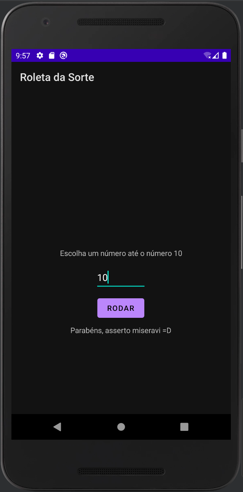

# Roleta da Sorte
versionCode: "1" 
versionName: "1.0.1"

# Introdução
Este aplicativo foi desenvolvido para fins academicos na aula de Desenvolvimento Android com Kotlin  
Temos como objetivo ter uma aplicação focado no jogo Roleta da Sorte, onde você poderá escolher um número de 0 até 10 e o sistema irá, de forma randomica, sortear um número. Se você acertar terá uma mensagem de sucesso, caso não, você perdeu!

